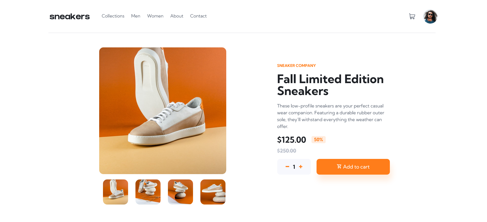

# Frontend Mentor - E-commerce product page solution

[E-commerce product page challenge on Frontend Mentor](https://www.frontendmentor.io/challenges/ecommerce-product-page-UPsZ9MJp6). Frontend Mentor challenges help you improve your coding skills by building realistic projects.

## Table of contents

- [Overview](#overview)
  - [The challenge](#the-challenge)
  - [Screenshot](#screenshot)
  - [Links](#links)
  - [Built with](#built-with)
  - [What I learned](#what-i-learned)
- [Author](#author)

## Overview

### The challenge

Users should be able to:

- View the optimal layout for the site depending on their device's screen size
- See hover states for all interactive elements on the page
- Open a lightbox gallery by clicking on the large product image
- Switch the large product image by clicking on the small thumbnail images
- Add items to the cart
- View the cart and remove items from it

### Screenshot




### Links

- Solution URL: [Add solution URL here](https://github.com/gerbelli27/ecommerce)
- Live Site URL: [Add live site URL here](https://gerbelli27.github.io/ecommerce/)

### Built with

- Semantic HTML5 markup
- CSS custom properties
- Flexbox
- Mobile-first workflow

### What I learned

This project was very challenging for me and showed me the points that I need to improve and the next steps to follow, most likely I start studying React, because I felt the need for tools to facilitate and accelerate development and I believe that React would be the right path .  To conclude this project I followed the layout provided by Frontend Mentor and all implementations were made using JavaScript, html and css only.  All feedbacks are welcome!


```js
const thumbs = document.querySelectorAll(".thumbnail");

for (let i = 0; i < thumbs.length; i++) {
    const buttonThumbs = thumbs[i]
    const img = thumbs[i].src;

    buttonThumbs.onclick = function () {
        document.querySelector(".image").src = img.replace("-thumbnail", "")
        document.querySelector(".image-pop").src = img.replace("-thumbnail", "")
    }

}
```
## Author

- Frontend Mentor - [@gerbelli27](https://www.frontendmentor.io/profile/gerbelli27)
- GitHub - [@gerbelli27](https://github.com/gerbelli27)

